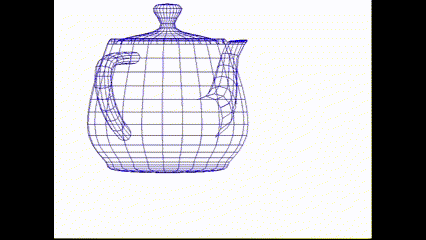

# larp

lame :speak_no_evil: rendering pipeline - a scratch built 3D rendering pipeline using only c++ and Simple DirectMedia Layer (SDL).



## Installation

First install the SDL library to provide low level access to the keyboard, mouse, and display.

```bash
sudo apt update
sudo apt install libsdl2-dev
```

Then compile and run the code.

```bash
git clone git@github.com:jonlee48/larp.git
cd larp
make
./larp
```

You can also run the samples.
`make samples`
- `./bin/01_bmp` Display an image from bmp format.
- `./bin/02_png` Display an image from png format.
- `./bin/03_texture` Display an image as a texture with HW acceleration. Kinda buggy when dragging windows. Had to put rendering in event loop. I think it's related to this [issue](https://github.com/libsdl-org/SDL/issues/1059#issuecomment-793116234).
- `./bin/04_geometry` Display some rectangles and lines in the window.

## TODO
-[ ] Scan conversion
-[ ] Makefile - o files and linker
-[ ] Makefile - does not detect changes to h files

## Valgrind

To check for memory leaks, run with Valgrind suppression file because SDL has leaks in the library.

```
valgrind --gen-suppressions=all --suppressions=./linux_sdl_gl.sup --leak-check=full --show-leak-kinds=all ./larp
```

Interesting reads
- [https://stackoverflow.com/questions/1997171/why-does-valgrind-say-basic-sdl-program-is-leaking-memory](https://stackoverflow.com/questions/1997171/why-does-valgrind-say-basic-sdl-program-is-leaking-memory)
- [https://stackoverflow.com/questions/5134891/how-do-i-use-valgrind-to-find-memory-leaks](https://stackoverflow.com/questions/5134891/how-do-i-use-valgrind-to-find-memory-leaks)


## Resources

- [Simple DirectMedia Layer (SDL Wiki)](https://wiki.libsdl.org/SDL2/FrontPage)
- [SDL Dynamic API](https://github.com/libsdl-org/SDL/blob/main/docs/README-dynapi.md)
- [SDL Tutorials](http://lazyfoo.net/tutorials/SDL/index.php)
- [X11 forwarding on WSL2](https://stackoverflow.com/questions/61110603/how-to-set-up-working-x11-forwarding-on-wsl2)
- [Syncing HW Clock on WSL2](https://askubuntu.com/questions/1096930/sudo-apt-update-error-release-file-is-not-yet-valid)
- [Makefile Tutorial](https://makefiletutorial.com)
