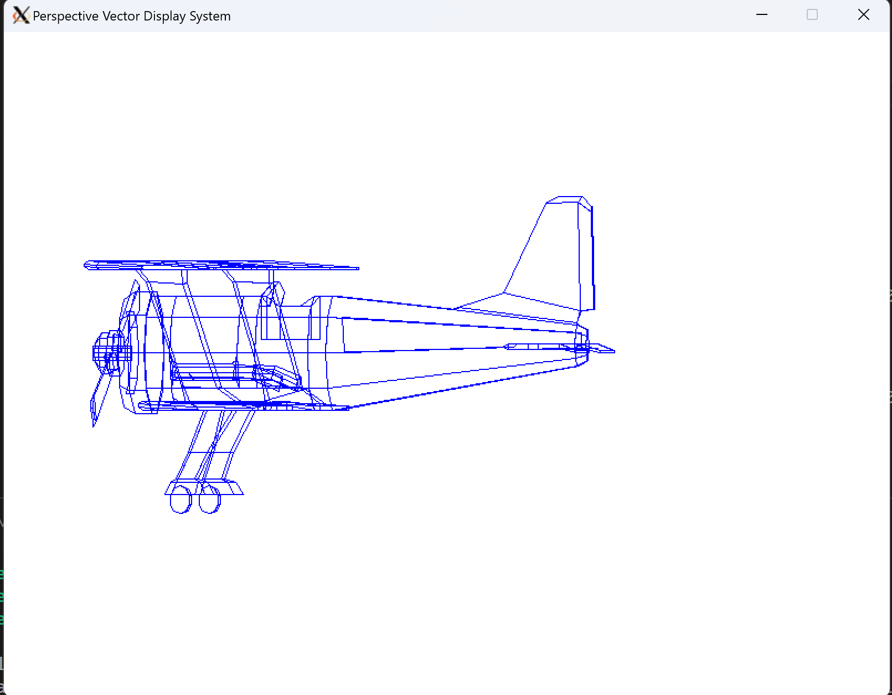
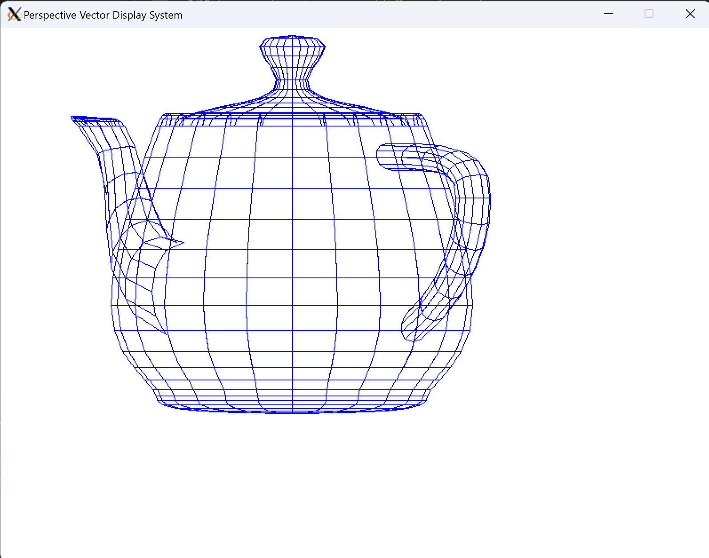
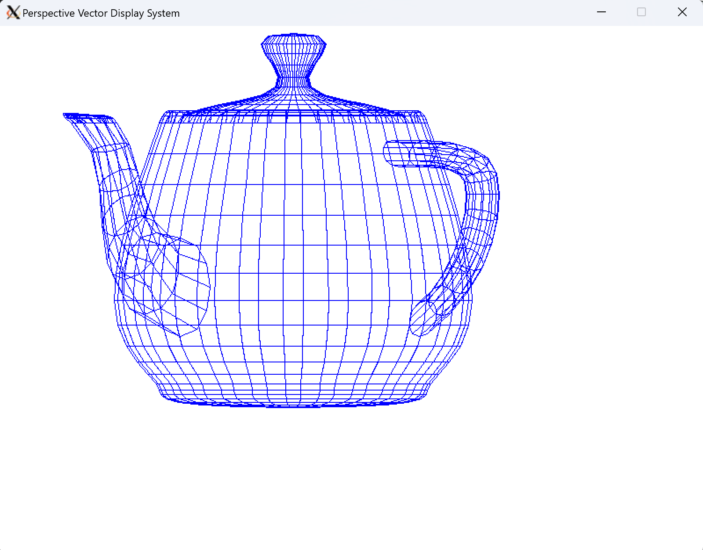

# Perspective Vector Display System

Computer Graphics II - Lab 1

Jonathan Lee


## Description

I implemented my rendering pipeline in C++ with Simple DirectMedia Layer (SDL) to provide low level access to the keyboard, mouse, and display. I chose SDL because it provides a simple interface to create a window and draw points and lines. 


## Implementation

I wrote several utility classes to provide vector/matrix functionality and structure the code. 

```c++
Class vec3 {		// vec3.h
    vec3(double x, double y, double z);
    dot(vec3 v);
    cross(vec3 v);
    normalize();
    ...
}
Class vec4 {...}	// vec4.h
Class mat4 {...}	// mat4.h
```

I also wrote a Camera and Model class. 

```c++
Class Camera {		// camera.h
    Camera();
    mat4 GetViewMatrix();
    mat4 GetPerspectiveMatrix();
}

Class Model {		// model.h
    LoadModel(const char* path);
    DrawEdges(Camera camera, SDL_Renderer *renderer);
    ResizeModel();
    CalcBound(vec3 min, vec3 max);
    Scale(double scale);
    Translate(vec3 offset);
    Rotate(double x, double y, double z);
}
```

The following describes the control flow of my main program:

```c++
int main() {
    init();			// Start up SDL and create window
    initScene();	// Load the models
    
    // Begin main loop
    while(!quit) {

        // Deal with events
        while(SDL_PollEvent(&e)) {
            if (e.type == SDL_QUIT)
                quit = true;
        }
        
        renderScene();	// DrawEdges() with backface culling
        model.rotate(0, x, 0);
        x += 0.01;
        SDL_Delay(1000/FPS);
    }
    
    end();			// Free resources and close SDL
    return 0;
}
```

The `DrawEdges()` routine takes the faces of the model and calculates what it would look like in device coordinates by applying the model view matrix. It only draws faces that are not backfacing.

```c++
void Model::DrawEdges(Camera &camera, SDL_Renderer *renderer) {
    // Calculate transformation matrix
    mat4 model_matrix = translate_matrix * rotate_matrix * scale_matrix;
    mat4 view_matrix = camera.GetViewMatrix();
    mat4 perspective_matrix = camera.GetPerspectiveMatrix();
    mat4 model_view_matrix = perspective_matrix * view_matrix * model_matrix;

	// For each face in the model
    for (unsigned int i = 0; i < faces.size(); i++) {
		// For each edge
        for (unsigned int k = 0; k < faces[i].indices.size(); k++) {
            int p0 = faces[i].indices[k];
            int p1 = faces[i].indices[(k + 1) % faces[i].indices.size()];
			
            // Apply model_view_matrix
            vec4 h0 = model_view_matrix * vec4(verts[p0], 1.0f);
            vec4 h1 = model_view_matrix * vec4(verts[p1], 1.0f);

            // Check if the face normal is not backfacing 
            vec4 n4 = model_view_matrix * vec4(face_normals[i], 1.0f);
            vec3 normal = vec3(n4.x, n4.y, n4.z).normalize();
            if (normal.z < 0) {            {
                // Render the line 
                
                // Scale normalized coordinates to device coordinates
                double x1 = 200.0*h0.x+400;
                double x2 = 200.0*h1.x+400;
                double y1 = 200.0*h0.y+600;
                double y2 = 200.0*h1.y+600;
                // flip y axis
                y1 = 600 - y1;
                y2 = 600 - y2;
                SDL_RenderDrawLine(renderer,x1,y1,x2,y2);
            }
        }
    }
}
```


## Examples

Biplane:




Teapot:



Teapot (without backface culling):

